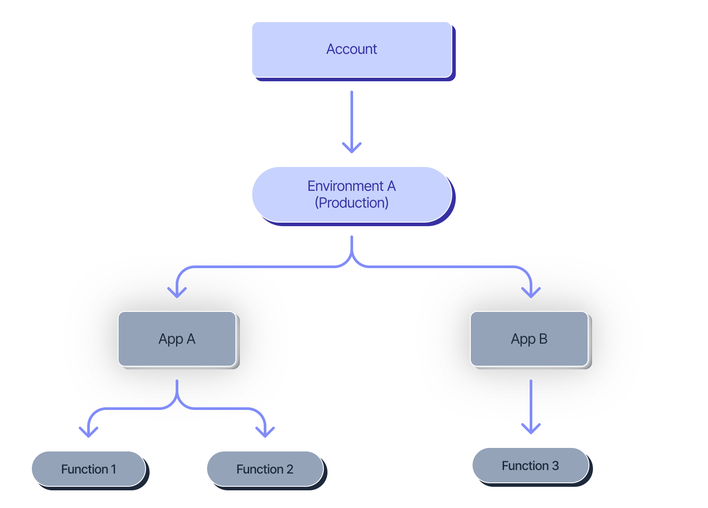
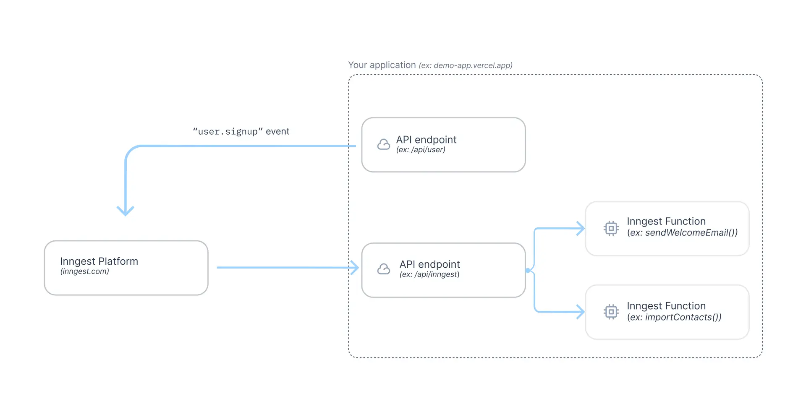

# RAG Production App

An end-to-end **Retrieval-Augmented Generation (RAG)** system that lets you upload PDF documents, index them in a vector database, and ask natural-language questions answered by an LLM grounded in your documents.

---

## Overview

- **Upload PDFs** via a Streamlit UI — they are chunked, embedded locally, and stored in Qdrant automatically.
- **Ask questions** — your query is embedded, the most relevant chunks are retrieved, and Gemini generates a concise, context-grounded answer.
- **Durable pipeline** — every step runs inside an Inngest function, giving you full observability, automatic retries, and a step-by-step audit trail.

---

## Tech Stack

| Layer | Technology |
|---|---|
| Frontend | Streamlit |
| Orchestration | Inngest |
| API Worker | FastAPI + Uvicorn |
| Embeddings | sentence-transformers (`all-MiniLM-L6-v2`) |
| Vector Store | Qdrant |
| LLM | Gemini (via OpenAI-compatible endpoint) |
| PDF Parsing | LlamaIndex + SentenceSplitter |

---

## Project Structure

```
C:\Users\binay\OneDrive\Desktop\RAG Production App\
│
│   # Source files
├── app.py                  # Streamlit frontend — upload, query, display answers
├── main.py                 # FastAPI app + Inngest function definitions
├── data_loader.py          # PDF loading, chunking, and local embedding
├── vector_db.py            # QdrantStorage wrapper (upsert + cosine search)
├── custom_types.py         # Pydantic models for inter-step data contracts
│
│   # Project config
├── pyproject.toml          # Project metadata and dependencies (uv / PEP 517)
├── uv.lock                 # Locked dependency versions (auto-generated by uv)
├── .python-version         # Pinned Python version for uv
├── .env                    # Runtime secrets — never commit this file
├── README.md               # Project documentation
│
│   # Runtime directories (auto-created)
├── uploads\                # PDFs saved here after upload via the UI
├── qdrant_storage\         # Local Qdrant on-disk persistence
│
│   # Auto-generated / IDE (not committed)
├── .venv\                  # Virtual environment (managed by uv)
├── __pycache__\            # Python bytecode cache
└── .idea\                  # PyCharm IDE settings (not committed)
```

> **IDE:** This project was developed in **PyCharm**. The `.idea\` folder stores run configurations, interpreter settings, and code style preferences. Add it to `.gitignore` to avoid committing IDE-specific files.

---

## Inngest Architecture

Inngest is the orchestration backbone of this project. It provides durable execution, automatic retries, and full observability for every pipeline step.

### App & Function Hierarchy

An **Account** contains one or more **Environments** (e.g. Production). Each environment hosts one or more **Apps**, and each App registers one or more **Functions** triggered by events.



In this project the single app `intellify_task_app` registers two functions:
- `RAG: Ingest PDF` — triggered by `rag/ingest_pdf`
- `RAG: Query PDF` — triggered by `rag/query_pdf_ai`

### How Inngest Triggers Work

When the Streamlit UI fires an event, the Inngest platform receives it and forwards it to your application's API endpoint (`/api/inngest` served by FastAPI). The endpoint dispatches it to the matching Inngest function, which executes its steps durably.



---

## Setup

### Prerequisites

- Python 3.13+
- [uv](https://github.com/astral-sh/uv) (or pip)
- Docker (for Qdrant)
- Node.js (for Inngest Dev Server)
- A [Google Gemini API key](https://aistudio.google.com/app/apikey)

### Installation

```bash
# 1. Install dependencies
uv sync

# 2. Configure environment
cp .env.example .env
# Edit .env and set your GEMINI_API_KEY

# 3. Start Qdrant
docker run -p 6333:6333 qdrant/qdrant

# 4. Start Inngest Dev Server
npx inngest-cli@latest dev

# 5. Start the FastAPI worker
uvicorn main:app --reload --port 8000

# 6. Start the Streamlit UI
streamlit run app.py
```

---

## Environment Variables

| Variable | Required | Default | Description |
|---|---|---|---|
| `GEMINI_API_KEY` | Yes | — | Google Gemini API key |
| `INNGEST_API_BASE` | No | `http://127.0.0.1:8288/v1` | Inngest Dev Server URL |

---

## How It Works

### PDF Ingestion (`rag/ingest_pdf`)

1. User uploads a PDF in the UI — saved to `uploads/`.
2. Inngest event `rag/ingest_pdf` is fired.
3. **Step 1 — `load-and-chunk`**: PDFReader parses the file; SentenceSplitter produces 1000-token chunks with 200-token overlap.
4. **Step 2 — `embed-and-upsert`**: `all-MiniLM-L6-v2` embeds every chunk (dim=384); deterministic UUIDs are assigned; points are upserted into Qdrant with `source` and `text` metadata.

### Querying (`rag/query_pdf_ai`)

1. User types a question and selects `top_k` in the UI.
2. Inngest event `rag/query_pdf_ai` is fired.
3. **Step 1 — `embed-and-search`**: The question is embedded and Qdrant returns the top-k nearest chunks.
4. **Step 2 — `llm-answer`**: Retrieved chunks are assembled as context and sent to Gemini via the Inngest AI adapter. Temperature is set to `0.2` for factual responses.
5. The UI polls the Inngest local API until the run completes, then displays the answer and source filenames.

---

## Configuration

**Chunking** — adjust in `data_loader.py`:
```python
splitter = SentenceSplitter(chunk_size=1000, chunk_overlap=200)
```

**Embedding dimension** — must match the model output. Default is `384` for `all-MiniLM-L6-v2`. Update `dim` in `QdrantStorage` if you switch models.

**LLM** — configured in `main.py`:
```python
adapter = ai.openai.Adapter(
    auth_key=os.getenv("GEMINI_API_KEY"),
    base_url="https://generativelanguage.googleapis.com/v1beta/openai/",
    model="gemini-3.1-flash-lite-preview",
)
```

---

## Dependencies

```
fastapi, uvicorn, streamlit, inngest, qdrant-client,
sentence-transformers, llama-index-core, llama-index-readers-file,
openai, google-genai, python-dotenv
```

Install all via `uv sync` or `pip install -e .`.

---

## Known Issues

- `QdrantStorage.__init__` references `self.dim` before it is assigned — add `self.dim = dim` to fix.
- The Streamlit polling loop blocks the UI thread; a background thread or `st.rerun` approach would improve responsiveness.
- Re-uploading the same PDF upserts duplicate vectors (deterministic UUIDs mitigate this for identical content).
